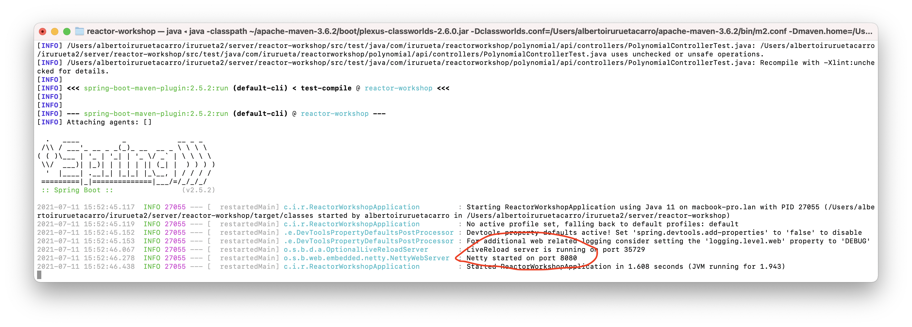
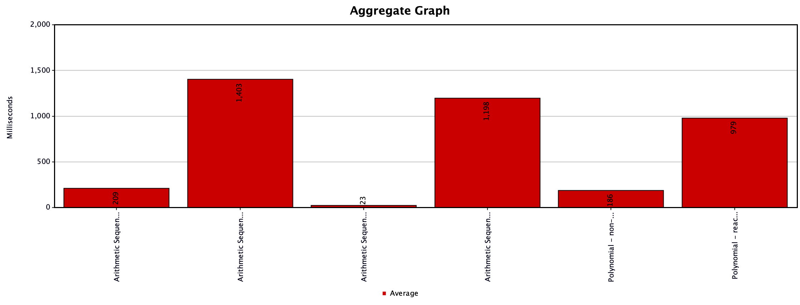
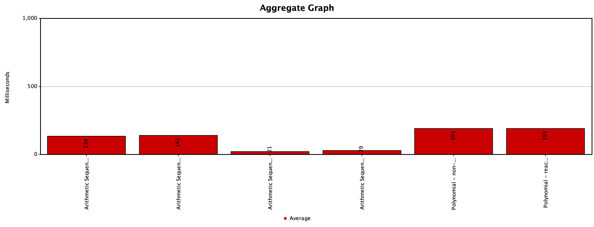
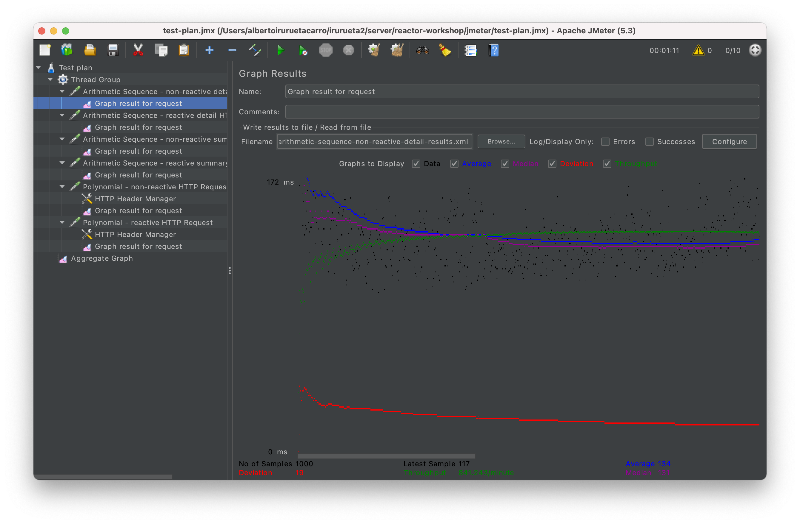
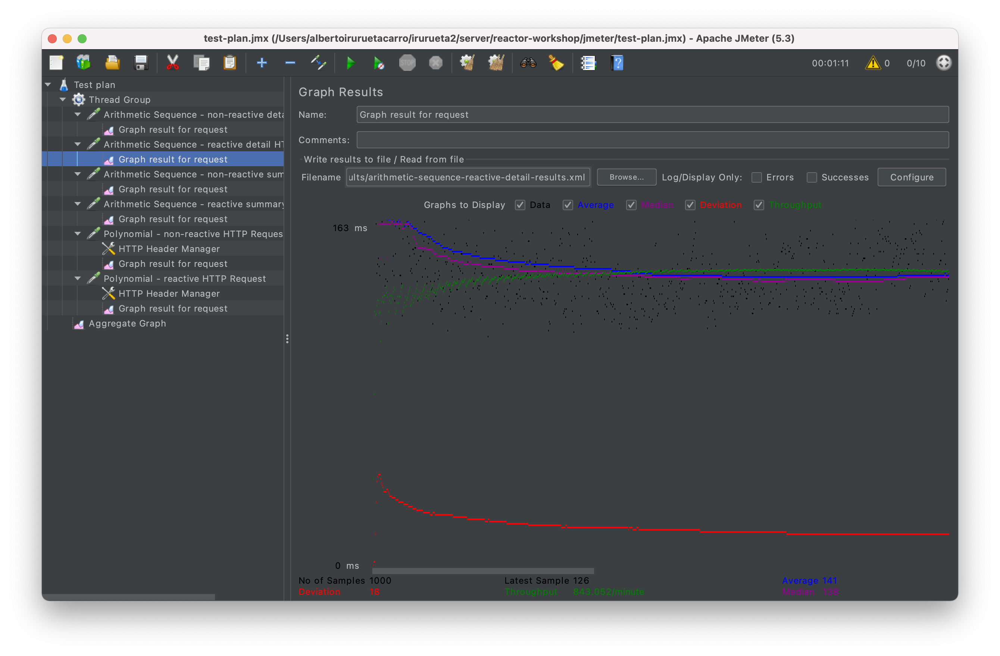
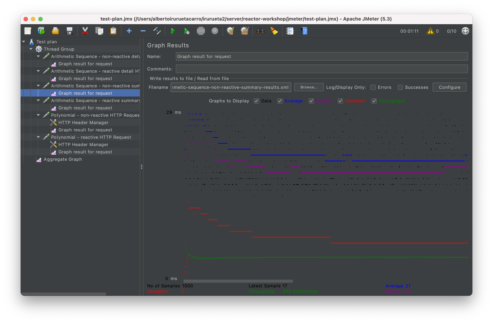
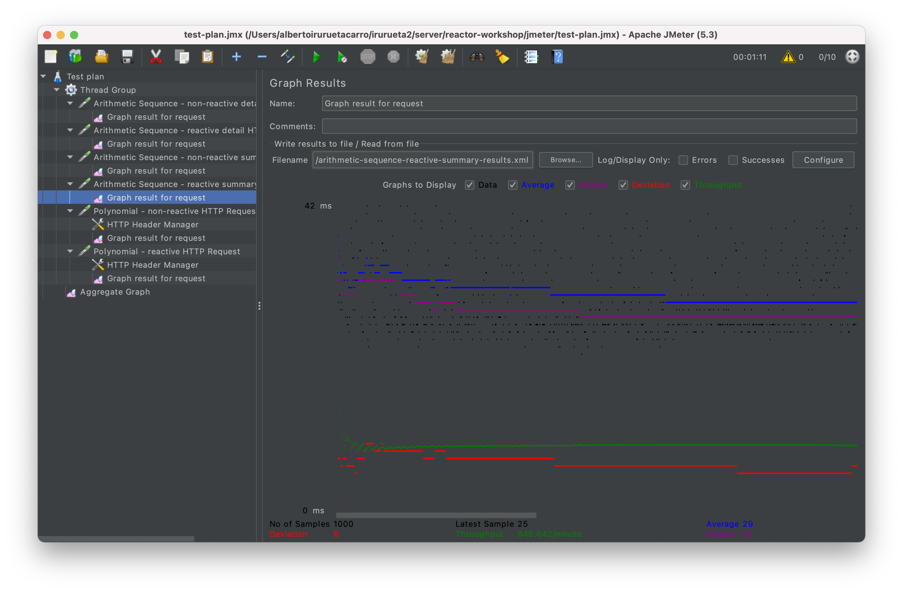
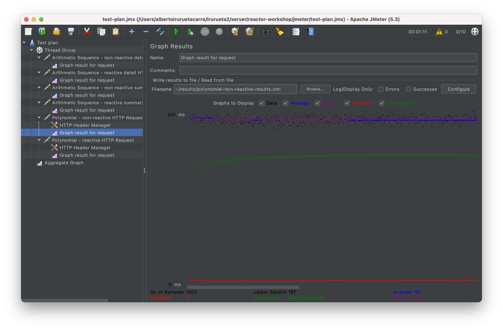
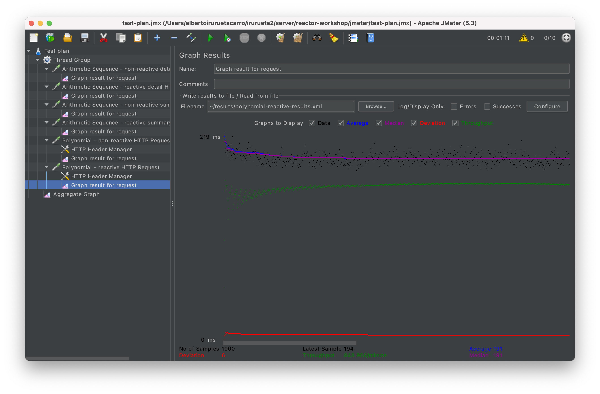

# Spring Reactor workshop

This repository contains a workshop to introduce reactive programming using Spring Reactor.

Firstly, some theory, tips and use cases will be given. Then, some exercises will be proposed.

For additional information, take a look at the [Official documentation](https://projectreactor.io)
Additional official training is available in the
[Reference guide](https://projectreactor.io/docs/core/release/reference/)

## Overview

Project reactor is based in the following principles:

- I/O Multiplexing
- Callback avoidance
- Backpressure handling

## I/O Multiplexing

I/O multiplexing is not a new technology, it has existed since the 80's and takes advantage of the OS native handling of
file descriptors, which allows access to sockets, pipes and files to handle multiple server requests in a single thread
being shared among multiple clients, this possible because among other things OSes provide buffering capabilities on
files and TCP/IP network stacks.

POSIX implementations treats access to sockets, pipes (communication between processes) and files in a standardized way.
When a file is opened, or sockets and pipes are created, a unique file descriptor is assigned to them.

Several functions are defined to create such resources and assign a file descriptor to them. Such as the ones shown
below:

### Open file

Returns file descriptor

https://man7.org/linux/man-pages/man2/openat.2.html

### Create a pipe

Similar to open file but for process intercommunication Returns an array of two file descriptor (for read and write)

https://man7.org/linux/man-pages/man2/pipe.2.html

### Sockets

*Socket*: Create a socket and returns a file descriptor for an unnamed socket

https://man7.org/linux/man-pages/man2/socket.2.html

*Bind*: Associates an unnamed socket to an IP address and port. This is typically done in servers

https://man7.org/linux/man-pages/man2/bind.2.html

*Listen*: Marks a socket to receive connections passively. This is done so that servers can receive connections
https://man7.org/linux/man-pages/man2/listen.2.html

*Accept*: Accepts a connection to a socket when a connection is received
https://man7.org/linux/man-pages/man2/accept.2.html

### Reading and writing

Reading and writing on an open file descriptor is done using:

*Read*:
https://man7.org/linux/man-pages/man2/read.2.html

*Write*:
https://man7.org/linux/man-pages/man2/write.2.html

Additionally, on sockets sending and receiving methods exist that allows providing additional flags to configure sockets
communications and headers:

*Sendto*: Sends data through a socket
https://man7.org/linux/man-pages/man2/sendto.2.html

*Recvfrom*: Reads data from a socket
https://man7.org/linux/man-pages/man2/recvfrom.2.html

Notice that calls for reading and writing can be blocking, because device might be busy at hardware level, data has not
arrived through network, or maximum network or device throughput is reached and no further data can be written at
request time.

### Select

Typically, the OS provides buffering capabilities when reading or writing to network or file resources. I/O multiplexing
takes advantage of this fact to share a single thread to handle multiple requests (i.e. sockets).

I/O can be multiplexed using calls to *select*:
https://man7.org/linux/man-pages/man2/select.2.html

Select accepts an array of file descriptors and indicates which ones contain data to be read or written immediately
without blocking when making read or write calls.

Typically, in servers implemented using POSIX calls, **select is called in a main loop**, to share a single thread to
read or write data to different sockets as they become available.


It is important to notice that I/O multiplexing allows sharing a single thread to handle multiple requests in a server.
This is important, because each thread in a server consumes memory (the OS assigns a stacktrace to each thread), and
switching between threads represents a small context switching overhead to the CPU. Consequently, the smaller the number
of required threads to handle a given amount of traffic, the more efficient the server will be.

### Java implementation

On initial Java versions, only blocking I/O API's were provided in the SDK I/O package:

*Java IO*: Streams, sockets, file descriptors...
https://docs.oracle.com/javase/7/docs/api/java/io/package-summary.html

In Java version 1.5, the NIO package was added to provide non-blocking support for I/O calls:

*Java NIO*: Channels and selectors to do multiplexed I/O
https://picodotdev.github.io/blog-bitix/2018/04/introduccion-a-nio-2-el-sistema-de-entrada-salida-de-java/
https://docs.oracle.com/javase/8/docs/api/java/nio/package-summary.html
https://docs.oracle.com/javase/8/docs/api/java/nio/channels/package-summary.html#multiplex

Although Java NIO allowed I/O multiplexing thanks the use of channels and selectors, their usage was kind of cumbersome
due to the need of callbacks. To avoid developing within a "callback hell" for complex implementations, Futures were
also supported.

## Callback avoidance

One of the principles of Spring reactor is based on the avoidance of callbacks (as they tend to make code more complex),
and instead an API is provided based in Flux and Mono, which work similarly to Futures in Java NIO.

- Flux: https://projectreactor.io/docs/core/release/api/reactor/core/publisher/Flux.html
- Mono: https://projectreactor.io/docs/core/release/api/reactor/core/publisher/Mono.html

Just like Futures, a Flux or a Mono instance represents a piece of code that will be executed in the future once a
certain condition is accomplished (e.g. data becomes available). It must be notice that a Flux, or a Mono will never be
executed until someone subscribes. If no-one is subscribed a Flux, or a mono is just an entity containing a piece of
code, but such piece of code is not actually executed.

### Reactor nifty features

Unlike Futures, project reactor adds some nifty features to Flux and Mono, to allow certain functionalities such as:

- Buffers: to help in backpressure handling
- Delays: in some situations we might need to throttle requests being made or received (to prevent attacks or excessive
  usage of third party services, higher or lower priority clients that can handle different rates of requests, etc).
- Retries: to develop resilient solutions when external services are prone to error.

Notice that both delays and retries can also be implemented using Resilience4J, which also gives support for Retry and
RateLimiter for both reactive and non-reactive flows. Both are also available using Spring annotations @Retryable and
@RateLimiter

More info here:

- [Retryable](https://www.baeldung.com/spring-retry)
- [Resilience4j](https://www.baeldung.com/resilience4j)

Notice however that using non-reactive rate limiters has a direct impact on the amount of concurrent users a server will
be able to handle, as typically non-reactive servers have a reserved thread pool that can handle requests, and if such
threads are kept idle because we use a rate limiter, then no further requests can be handled. This is no longer the case
in a reactive implementation.

## Flux vs. Mono

Mono defines a piece of code that will emit one or no items in the future, while Flux defines a piece of code that will
emmit more than item in the future. Since both entities are reactive, that means that a server does not need to receive
a full request to generate a full response in order to start reading or writing data. This has several advantages:

- the server can start processing a request or start sending a response sooner, decreasing delays.
- since items in reactive programming are parsed or generated as they are being received or sent, for some large
  requests or responses, there is no need to keep in memory a full collection of items, thus reducing the amount of
  required memory. In extreme cases, a Flux could be used for a continuous streaming of data between servers.

It must be noticed that a flux can be converted to a Mono of a collection:
https://grokonez.com/reactive-programming/reactor/reactor-convert-flux-into-list-map-reactive-programming

However, this has implications in delays (we must wait until the Flux completes) and memory usage (the whole collection
of data emitted by the flux must be kept in memory). The same happens when a Flux needs to be sorted.

That said, let's take a look into the lifecycles of Flux and Mono, and see their differences.

### Lifecycles of Flux and Mono

Flux and Mono have certain similarities. Both are based on a two stage basis where a reactive chain of Fluxes or Monos
is built to be executed later in the future, and only when a consumer is subscribe, actually code is executed and
elements are emitted.

The main difference between a Flux and Mono is that a Flux can emit more than one element reactively once a consumer is
subscribed (even a continous stream of elements), while Mono can emit at most one element.

Both Flux and Mono notify when:

- subscription occurs: `doOnSubscribe(...)`
- an element is emitted: `doOnNext(...)`
- reactive flow is completed: `doOnComplete(...)`
- reactive flow fails: `doOnError(...)`


Notice that there are other `doXxx(...)` methods, however, all these methods are meant to be used as auxiliary methods,
(e.g. logging) not as the main execution path. *A common mistake is to call a reactive method within these auxiliary
methods*.

## Schedulers

By default, a reactive flow is processed on a single thread (immediate scheduler), however, emitted results of a Flux or
Mono can be published on a given scheduler, and likewise, subscription to a given Flux or Mono can also occur on a given
scheduler.

A scheduler is an abstract representation of a thread, and Reactor provides multiple representations by default (that
can be further customized if needed). Some of the most important schedulers are:

- Immediate: represents the current thread. No additional thread context switching is needed.
- Parallel: Is a pool of threads which has a size equal to the number of CPU processors. This pool of threads is meant
  to be used by long CPU intensive tasks that can be run in parallel. To avoid thread context switching, each thread in
  the pool is used by each CPU core.
- Elastic: Is a pool of threads meant to be used for I/O purposes. This means that the pool should have a maximum size
  equal to the number of concurrent file descriptors (e.g. sockets or requests) being handled concurrently. This pool
  should be preferred over parallel scheduler for tasks that are I/O bounded.

Schedulers:
https://projectreactor.io/docs/core/release/api/reactor/core/scheduler/Schedulers.html

publishon vs subscribeon:
https://stackoverflow.com/questions/48073315/publishon-vs-subscribeon-in-project-reactor-3

It must be noticed that *publishon* continues to take effect on subsequent operators in the reactive chain, while *
subscribeon* applies to the reactive operator being applied to.

Thanks to I/O multiplexing and schedulers, reactive flows in a server can be seen as a single thread constantly looping
waiting for data to be received or sent, and notifying to scheduled tasks in different threads whenever a file
descriptor becomes available to send or receive data.


Because a single thread can be reused by a single requests by I/O multiplexing, even if requests are delayed or retried,
this has minimal impact on the server.

## Reactor context

When a reactive chain of Flux and Mono is built, each Flux or Mono in the chain does not need to be processed in the
same thread. Each step might be processed in different threads, and this has several implications in transversal
services typically used in a server such as:

- Authentication
- Transactions
- Caching

Reactor context allows storing in an in-memory map certain data for each reactive flow that is shared between elements
(Flux or Mono) in the reactive chain.

Access to Reactor context is done through calls like `Mono.subscriberContext(...)`. Notice that setting values in
reactor context is done as the last step in the chain, right before subscription, and it applies to all previous
elements in the chain up to the root element.

Thanks to reactor context, transversal functionalities such as the ones shown above can be implemented.

In Spring 5, proper support for these features has been added for reactive programming using Spring Reactor and common
Spring annotations.

### Authentication

By default, Spring security parses JWT (Java Web Tokens) received on a request to determine a user role and permission.
Spring Security uses annotations such as @Preauthorize or @Secured to automatically handle authorization of methods
being executed.

Additional information about method security:
https://www.baeldung.com/spring-security-method-security

It must be noticed that Spring handles usage of @Preauthorize or @Secured annotations in reactive implementations just
as it does for non-reactive ones, so that their behavior is the same. However, internally Spring uses
`ReactiveSecurityContextHolder` to access to security information and store such data into Reactor context so that it
can live to multiple thread context switches.

**Example:**

```
@Test
public void setContextAndClearAndGetContextThenEmitsEmpty() {
  
  SecurityContext expectedContext = new SecurityContextImpl(
    new TestingAuthenticationToken("user", "password", "ROLE_USER"));

  Mono<SecurityContext> context = Mono.subscriberContext()
    .flatMap( c -> ReactiveSecurityContextHolder.getContext())
    .subscriberContext(ReactiveSecurityContextHolder.clearContext())
    .subscriberContext(ReactiveSecurityContextHolder.withSecurityContext(Mono.just(expectedContext)));
  
  StepVerifier.create(context)
    .verifyComplete();
}
```

### Transactions

Typically, transactions in non-reactive Java servers are handled through @Transactional annotation, to ensure that
multiple requests to a transactional database (typicaly SQL databases) or to queueing services (such as JMS queues) are
handled as an atomic operation that either succeeds or fails and is rolled-back, either by using local or distributed
transactions when multiple services are involved.

In those cases, since non-reactive servers reserved on thread per request, typically
[ThreadLocal](https://www.baeldung.com/java-threadlocal) variables were used to keep transaction status.

However, in reactive implementations, ThreadLocal variables are no longer appropriate since Thread context switching
might occur at different steps in a reactive chain.

Again, spring comes to the rescue and is able transparently to handle @Transactional annotations in reactive chains
thanks to Reactor context.

### Caching

As expected, @Cache is also supported by Spring in reactive implementations, however in this case some considerations
must be taken into account.

Typically, caches are either distributed (in a server) or in memory. Each cache is assigned a name, and a given type of
object is stored by a given key.

When using @Cache in reactive implementations, care must be taken to not share the same cache name for reactive and
non-reactive implementations, since different kinds of objects will be stored in the cache (Monos and Fluxes in reactive
ones vs the actual values in non-reactive ones), and this will cause ClassCastException's at runtime.

## Backpressure

One of the features that Reactor provides is backpressure, which is the ability to adapt the rate at which elements are
emitted in a reactive flow, so that a slow consumer can be able to process them.

Methods such as `limitRange()`, `onBackpressureDrop()` or `buffer()` can be used to determine a given backpressure
strategy. However, for typical servers backpressure is handled automatically and should rarely be manually defined.

https://www.baeldung.com/spring-webflux-backpressure

https://stackoverflow.com/questions/57296097/how-does-backpressure-work-in-project-reactor

https://www.e4developer.com/2018/04/28/springs-webflux-reactor-parallelism-and-backpressure/

## Sequential and parallel executions

By default, reactor builds sequential chains to be executed. Typical operators to be used in sequential chains are:

- `then(...)`: Executes a new reactive chain after the current one. The result of the current one is discarded.
- `thenReturn(...)`: When the result of current chain must be discarded and instead return a given value.
- `map(...)`: Maps an element emitted by a Flux or Mono into another type. Notice that map can never return null.
- `flatMap(...)`: Similar to `map(...)`, however instead of converting to another type, it subscribes to another
  reactive flow.

Sometimes parallel execution of multiple reactive chains is desired. Typical operators to be used in parallel execution
are:

- `Mono.when(...)`: waits until all provided publishers are completed to continue to the next step in the chain. The
  result of provided publishers is discarded.
- `Flux.parallel(...)`: divides each emitted element in a flux to be processed in a given amount of threads defined by
  provided parallelism value (or number of cpus if not provided)
- `Flux.merge(...)`: merges provided publishers into a single Flux as elements are emitted. Notice that merged items can
  then be published on multiple threads using `Flux.parallel(...)`
- `Flux.flatMapSequential(...)`: maps sequential items in a flux to publishers (similarly to `Mono.flatMap(...)`) and
  subscribes to returned publishers usig provided concurrency value.

Flux parallel vs Mono.zip
https://www.baeldung.com/spring-webclient-simultaneous-calls

## Common patterns

### Creation

Usually Flux or Mono is built by the server when a request is made (e.g. at a reactive REST controller). In such cases,
operators are added to the reactive chain until the whole request is handled.

However, there are utility operators that can be used to create Flux or Mono instances. Some of the most typical are:

- `Mono.just(...)`: Creates a mono that emits provided value. Notice that since value is provided before Mono creation,
  then code called to built such value is actually executed before subscription occurs.
- `Mono.fromCallable(...)`: Executes callable (a function with parameters returning void) when subscription occurs.
- `Mono.fromRunnable(...)`: Executes runnable (a function without parameters returning void) when subscription occurs.
- `Mono.fromSupplier(...)`: Executes supplier (a function with parameters returning a value) and emits returned value
  when subscription occurs.
- `Flux.fromIterable(...)`: Creates a flux emitting items in provided iterable when subscription occurs.
- `Flux.fromArray(...)`: Creates a flux emitting items in provided array when subscription occurs.
- `Flux.fromStream(...)`: Creates a flux emitting items in a stream when subscription occurs.

### Interleaving non-reactive code

In a reactive chain, some operators can be used to execute non-reactive code, such as:

- `Mono.fromCallable(...)`
- `Mono.fromRunnable(...)`
- `Mono.fromSupplier(...)`
- `doOnNext(...)`
- `doOnSubscribe(...)`
- `doOnNext(...)`
- `doOnComplete(...)`
- `doOnError(...)`

These methods can be used in combination with `flatMap(...)`, `then(...)` etc, to interleave non-reactive code in a
reactive chain.

Caution must be used when interleaving non-reactive code to avoid *anti-patterns* such as:

- Blocking on reactive publishers (Monos or Fluxes)
- Forgetting to subscribe to reactive publishers

### Branching non-reactive code

Branching occurs when code contains if clauses to execute different code paths depending on available parameters. The
main methods used for branching are:

- Non-reactive: `Mono.map(...)`
- Reactive: `Mono.flatMap(...)`

Notice that `map(...)` can be considered a sub-case of flatMap, since `map(...)`is equivalent to:

```
flatMap(parameters -> ... Mono.just(value))
```

On the other hand, `flatMap(...)` is more versatile and allows branching reactive flows, returning publishers to be
subscribed to, or even errors (e.g. `Mono.error(...)`), depending on available parameters.

### Error handling

When an error occurs in a reactive chain, the processing of the chain stops, and no subsequent operators are processed
by default.

Errors can occur in a non-reactive block of code within the chain as a typical Java exception, or can be emitted in a
reactive chain as `Mono.error(...)`.

Special methods exist to handle situations where an error has occurred such as:

- `doOnError(...)`: executes non-reactive code when an error occurs.
- `onErrorMap(...)`: maps one throwable to another
- `onErrorResume(...)`: similar to flat map but for errors. Input throwable is processed by subscribing to a subsequent
  publisher, that might emit another error (e.g. `Mono.error(...)`) or simply execute another reactive flow.

Additionally, errors can be handled using retries, as shown below.

### Retries

When an error occurs on a reactive operator, such operator can be retried following a given set of rules such as:

- number of times to retry
- exceptions to be retried or to be emitted.
- back-off delays

**Example:**

```
Mono<T> method(Mono<T> inputMono, int maxRetries) {
  return inputMono.retryWhen(Retry.max(maxRetries).filter(throwable -> throwable instanceof MongoException)
            .onRetryExhaustedThrow((spec, signal) -> signal
                .failure()));
}
```

This code snippet defines a RetrySpec to retry provided `inputMono` a maximum of `maxRetries` if `MongoException`
occurs, otherwise exception is directly emitted and reactive chain execution fails. When a given RetrySpec is
exhausted (e.g. the maximum number of retries is reached), a RetryExhaustedException is emitted by default, however, in
this case, we map such exception to the original signaled exception using
`signal.failure()`

## Anti-patterns

Out experience with Reactor indicates that there are mainly 2 anti-patterns that need to be watched carefully to avoid
mistakes:

- Inadvertently building a `Mono` or `Flux` without subscribing to it.
- Calling `block()` in situations that may lead to deadlocks.

### Not subscribing to a Publisher

This is the most common mistake. It must be very clear that Reactor has 2 stages:

- The whole chain of `Mono` or `Flux` is built (except for the deferred ones, or the ones that depend on parameters
  obtained in previous steps such as in `flatmap()`)
- Each step of the chain is executed once subscription to the chain occurs.

It is easy to make the mistake of calling a method in a non-reactive piece of code that returns a Mono or a Flux and
forgetting to do any action with it (usually subscribe to it, blocking on it should be avoided as much as possible as we
will see in next anti-pattern).

**Example 1:**

```
public class A { }

...

private Mono<A> filter(A item) { ... }

...

public Mono<A> execute(long id) {
  return repository.get(id).doOnNext(a -> filter(a));
}
```

In this example, call to filter method makes no action, it just builds a Mono, but no-one is ever subscribed to it.
Whenever a new item is reactively emitted by the repository, `doOnNext()` is executed, and filter is called to build a
new Mono, but such mono is discarded, hence no action occurs.

A possible solution could be:

```
public Mono<A> execute(long id) {
  return repository.get(id).flatMap(a -> filter(a));
}
```

With this fix, flapMap subscribes to the Mono returned by `filter()`

**Example 2:**

```
public class A { }

...

private Mono<Void> notify(A item) { ... }

private Mono<Void> execute(A item) {
  return repository.update(item).map(a -> notify(a)).then();
}

```

In this case no-one subscribes to the result of `notify(a)` and consequently its code is never executed. Notice
that `map` will convert a object `a` of class A, into `Mono<Void>`. Consequently, if an additional operator was added to
the chain, we would be propagating a Mono of a Mono. However, since `then()` it is used, the result is discarded, and
the solution compiles (even though it does not work). The same would happen if any other operator of the kind thenX was
used (such as `thenReturn()`, `then(Mono)`, etc).

Again, a possible solution would be to use a `flatMap` instead, to ensure that subscription occurs.

```
private Mono<Void> execute(A item) {
  return repository.update(item).flatMap(a -> notify(a)).then();
}
```

### Wrong usage of block()

As a general rule, `block()` should never be called unless there is a really good reason to call it. The purpose of
using reactive programming is precisely to avoid blocking threads and return and process data as it becomes
available. `block()` precisely defeats this purpose.

Consequently, if we feel that we need to block on a non-reactive piece of code within a reactive chain, we should
probably consider refactoring the whole chain.

However, aside from the fact that `block()` might result in performance penalties because we are blocking threads, there
are really more subtle issues that may load to **dead-locks** that will make the whole server unresponsive.

Dead-locks might occur under situations of heavy loads of work to be processed. Under such circumstances, all of the
threads used by the Reactor schedulers might be in used, and calling `block()`in such situations will force Reactor to
wait for another thread to become available, but if we do that within a non-reactive piece of code inside a reactive
chain... well, the thread might never be available because we are already using it... and we are in a dead-lock.

Then requests start queueing, and finally your whole server becomes unresponsive.

In summary:

- Do not use block within pieces of non-reactive code within a reactive chain, such as in a `Mono.fromCallable`,
  `Mono.fromRunnable`, `doOnNext`, `map`, etc.
- Calling block in tests, or from non-reactive code (outside of a reactive chain), such as in a non-reactive message
  consumer, is ok.
- When in doubt, consider refactoring your code to avoid using block()

## Testing

StepVerifier is the main tool provided by reactor for testing purposes. Even though we can simply call `block()`and use
Mockito to test a reactive chain of code, StepVerifier provides additional features such as "virtual time", so that
delays and retries can be tested without actually waiting for timeouts, thus making tests much faster to execute.

[Using StepVerifier](https://www.baeldung.com/reactive-streams-step-verifier-test-publisher)

Typical usage of StepVerifier uses methods such as:

- `create(...)`: creates a sep verifier to execute provided publisher (Mono or Flux).
- `verify()`: executes the reactive flow checking provided requirements.
- `verifyError(...)`: expects the reactive flow to end with (provided) error.
- `verifyComplete()`: expects the reactive flow to be successfully completed.
- `expectComplete()`: expects the reactive flow to completely execute successfully.
- `expectNext(...)`: indicates the next element to be expected.
- `expectNextCount(...)`: indicates the amount of items to expect to be received
- `expectError(...)`: indicates the next element produces provided error.
- `expectSubscription()`: expects a subscription to occur.
- `withVirtualTime(...)`: executes provided publisher within a supplier using virtual time
    - `expectNoEvent(...)`: advances virtual time for provided duration and expects no event to occur.
    - `thenAwait(...)`: advances virtual time for provided duration

## Exercises

The following exercises are proposed as a way to test some characteristics provided by Spring Reactor.

Exercises can be started right away, or if you prefer you can check the branch `templates` where you will find an almost
complete solution where the only missing parts are the reactive services.

Completed exercises will be made available in the `exercises` branch, which will eventually be merged into the `main`
branch.

### Exercise 1:

Arithmetic Sequence generation

We will implement a REST endpoint accepting minimum and maximum values to be generated sequentially in the response and
then compute the arithmetic sum of each value in the sequence:
https://www.mathsisfun.com/algebra/sequences-sums-arithmetic.html

Solution must be implemented:

- Non-reactively
- Reactively

For each response, execution time and memory usage must be returned.
https://stackoverflow.com/questions/17374743/how-can-i-get-the-memory-that-my-java-program-uses-via-javas-runtime-api/17376879

### Exercise 2:

Polynomial operations

- Input multiple trees of polynomial operations
- Each tree contains the following operations:
    - polynomial addition
    - polynomial subtraction
    - polynomial multiplication
- For each tree we must compute:
    - The resulting polynomial of the operations tree
    - The roots of the resulting polynomial
    - The minima of the resulting polynomial
    - The maxima of the resulting polynomial
    - The parameters of the first derivative of the polynomial
    - The parameters of the second derivative of the polynomial
    - The parameters of the integral of the polynomial

Solution must be implemented:

- Using rest controllers with POST endpoints to compute the polynomial operations mentioned above:
    - With a non-reactive implementation
    - With a reactive implementation parallelized as much as possible
- Delays will be accepted as a query parameter on the endpoints. Delays will be added to each evaluation in each
  provided tree of operations to compare non-reactive, vs reactive & parallel reactive implementations

Hint: https://github.com/albertoirurueta/irurueta-numerical

### Solutions

A solution is provided for both exercises in this repository as a Spring Boot application.

To test the implementation, you can simply execute this project from you favourite IDE or run the command below:

```
mvn spring-boot:run
```

By default, the server will run at http://localhost:8080

This application uses swagger and swagger-ui, which can be used to test the API at:

- http://localhost:8080/swagger-ui/
- http://localhost:8080/v2/api-docs

Additionally, a postman collection is provided for testing purposes.

### Conclusions

Below we expose the conclusions of the implemented solutions in this workshop.

#### Blocking vs non-blocking server stack

First of all, we had the dilemma to whether we should use a blocking or a non-blocking web server stack.

Webflux gives full reactive-support even at the network layer, while other servlet based servers (such as Tomcat,
Undertow or Jetty), can at most dispatch the request processing to a non-blocking thread, but the network communication
still happens in a blocking thread, which can lead to slow clients monopolizing thread usage in the server. For this
reason alone, in general, in situations where slow clients (i.e. cell phone clients with bad coverage) might send
requests to the server, webflux should be preferred.

More information available here:
[Spring MVC Async vs Spring WebFlux](https://baeldung-cn.com/spring-mvc-async-vs-webflux)

In summary, Spring Reactor is supported both by blocking and non-blocking web servers, which means it is safe to use
either `spring-boot-starter-web` or `spring-boot-starter-webflux` dependencies with REST controllers using Spring
Reactor.

Notice that by default, when using `spring-boot-starter-web` dependency, Spring Boot configures Apache Tomcat as a web
server. Other servlet embedded containers can be configured with Spring Boot and the
`spring-boot-starter-web` dependency as indicated here:
[Comparing Embedded Servlet Containers in Spring Boot](https://www.baeldung.com/spring-boot-servlet-containers)

When using `spring-boot-starter-webflux`, Spring Boot configures Netty as the web server (notice that Netty is protocol
agnostic, and can be used as a server for many protocols, including HTTP).

However, when both `spring-boot-starter-web` and `spring-boot-starter-webflux` dependencies are included, then Spring
Boot continues to use Apache Tomcat.

Because the purpose of this workshop was to test a full reactive stack, we removes `spring-boot-starter-web`, which was
required by MockMvc unit tests in the controllers. Consequently, MockMvc and its associated tests had to be removed as
well, since **MockMvc is not compatible with Webflux**.

Once the `spring-boot-starter-web` was removed, we could easily check that netty was being used when running our
application



By switching to Netty alone, we found some slight improvements in some of our response times respect to Apache Tomcat.

#### Reactive vs non-reactive implementations

Exercises were implemented both using reactive and non-reactive solutions.

For the reactive implementations, initially, we wanted to check whether we could take advantage of parallel execution,
which is easily provided by Spring Reactor when working with `Flux` instances.

To compare performances, Jmeter was used using 10 concurrent thread (users) with a ramp-up time of 1 second and 
repeating the requests 100 times to compute average response values and response times.

To our surprise, we found out that parallel execution in this case worsens performance.



This makes sense, since our service is mostly CPU bound, and has no additional dependencies with other services through
the network.

In situations when we have an aggregator service that has to call multiple times other services to aggregate data,
parallel execution can hugely decrease response time by making requests to other services in parallel rather than
sequentially. This is especially true when we are talking of response times per requests in the range of hundreds of
millisecons.

However, in our implemented exercises, since we are only constrained by CPU to process each request, the amount of time
required to process each part of the request that could potentially be parallelized was much smaller than the amount of
time required to make a thread context switch. As a consequence, using parallel `Flux` processing resulted in worse
response times for reactive implementations.

Thankfully, Spring Reactor makes it very easy to switch from a parallel execution to a sequential one, and we had to
modify only the following pieces of code:

In method **createStream** of class **BaseMultipleArithmeticSequenceService**, we switched from:

```
return Stream.iterate(1, n -> n + 1).limit(count).parallel().map(value -> {
...
});
```

to

```
return Stream.iterate(1, n -> n + 1).limit(count).map(value -> {
...
});        
```

In method **evaluate** of class **ReactiveMultiplePolynomialEvaluationService**, we switched from:

```
return flux.parallel().runOn(Schedulers.parallel()).map(singlePolynomialService::evaluate).sequential();
```

to

```
return flux.map(singlePolynomialService::evaluate);
```

An in method **evaluate** of class **ReactiveMultipleArithmeticSequenceService**, we switched from:

```
return Flux.fromStream(createStream(data, service)).parallel().runOn(Schedulers.parallel()).sequential();
```

to

```
return Flux.fromStream(createStream(data, service));
```

With these small changes, we could see that both reactive and non-reactive implementations were now comparable in terms
of performance:



Detailed Jmeter graphs for each request are provided below.  10 concurrent thread (users) with a ramp-up time of 1 
second were used, and requests were repeated 100 times to compute average and response times.

Arithmetic sequence non-reactive detail:


Arithmetic sequence reactive detail:


Arithmetic sequence non-reactive summary:


Arithmetic sequence reactive summary:


Polynomial non-reactive:


Polynomial reactive:


#### Summary
Taking into account that since we are using a full non-blocking stack such as Netty, we can easily take 
advantage of features provided by Spring Reactor (if we needed to) such as less resource requirements to handle the 
same amount of concurrent requests, backpressure and throttling management or easy parallelization of request 
executions.

As for the resource usage, we encourage you to use the Arithmetic Sequence summary endpoint with extremely large count 
values. When doing so with the non reactive implementation, memory usage will be much larger since list of results are 
temporarily kept in memory, leading to potential `OutOfMemoryError` for large values. This is no longer the case in the 
reactive implementation, and no matter how large the count value is, the required amount of memory will be the same. 
Notice however, that as count increases so does the response time since more computations need to be done and 
potentially a request timeout at client side might occur. However, from the server point of view, the reactive 
implementation will execute flawlessly.

On the other hand, polynomial REST controllers implementation has a delay parameter that can be used to delay the 
execution of polynomial evaluation.

When using blocking web servers, such as Apache. This can be a problem, since the whole thread is blocked during such
delayed execution, and the server might run out of available threads in the thread-pool.
This is no longer an issue for the reactive implementation when using netty, since it is a non-blocking server with full
reactive support.

Testing these limits is out of the scope of this workshop since thread pools used by Apache Tomcat are quite large 
(about 200 threads in size by default) and more specific performance testing tools would need to be used, requiring
servers to be deployed in testing environments.

However, using Jmeter alone, we should see some errors for the non-reactive implementation when delays are provided 
(e.g. delay=50), and a large number of threads is used (e.g. a value greater than 200), wherheas the reactive 
implementation should continue to run without issues.